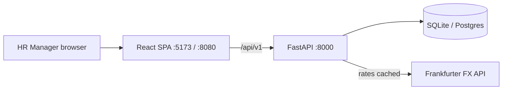
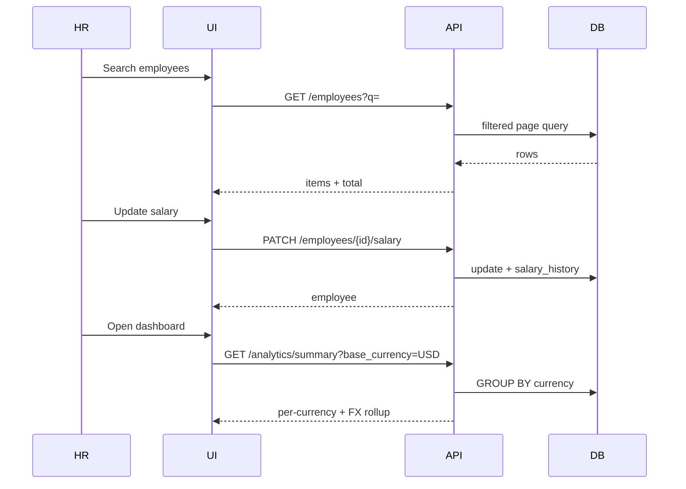

# Architecture diagram

```mermaid
flowchart LR
  HR[HR Manager browser]
  UI[React SPA :5173 / :8080]
  API[FastAPI :8000]
  DB[(SQLite / Postgres)]
  FX[Frankfurter FX API]

  HR --> UI
  UI -->|/api/v1| API
  API --> DB
  API -->|rates cached| FX
```

## Primary flows

```mermaid
sequenceDiagram
  participant HR
  participant UI
  participant API
  participant DB

  HR->>UI: Search employees
  UI->>API: GET /employees?q=
  API->>DB: filtered page query
  DB-->>API: rows
  API-->>UI: items + total

  HR->>UI: Update salary
  UI->>API: PATCH /employees/{id}/salary
  API->>DB: update + salary_history
  API-->>UI: employee

  HR->>UI: Open dashboard
  UI->>API: GET /analytics/summary?base_currency=USD
  API->>DB: GROUP BY currency
  API-->>UI: per-currency + FX rollup
```
